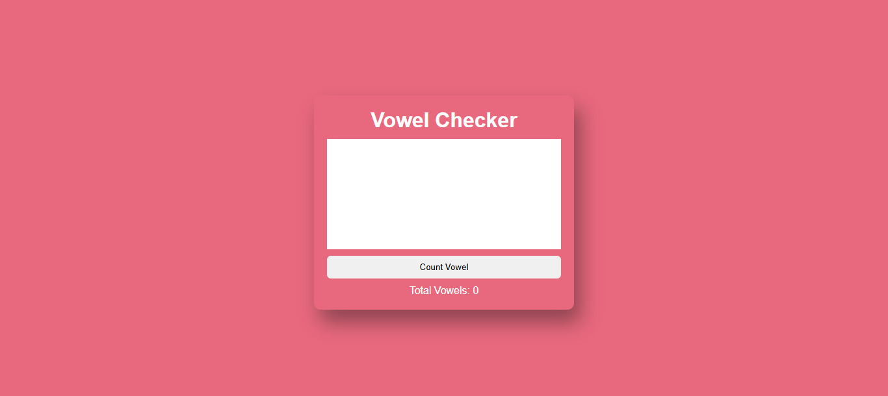

# 🧮 VOWEL CHECKER APP

## 🌟 About the Project  

The Vowel Checker App is a simple web-based tool that allows users to input a string of text and instantly count the number of vowels (A, E, I, O, U) present in the input. The application is built using HTML, CSS, and JavaScript, making it lightweight and easy to use.

Features
📝 Text Input: Users can enter any text in a textarea field.
🔍 Vowel Detection: The app counts and displays the total number of vowels in the input text.
🚀 Real-time Interaction: A button triggers the vowel counting process.
🎯 User-Friendly Interface: Simple and intuitive UI for easy usage.

How It Works

The user enters a text into the textarea.
Upon clicking the "Check Vowels" button, the app processes the input.
It converts the text to lowercase and counts all occurrences of vowels (a, e, i, o, u).
The total count of vowels is displayed on the screen.
The input field is cleared for the next use.

Technologies Used

HTML – For structuring the app.
CSS – For styling and responsiveness.
JavaScript – For logic and functionality.

## 🚀 Live Demo  
🔗 [Visit the Website](https://calculator-rho-gules-96.vercel.app/)

